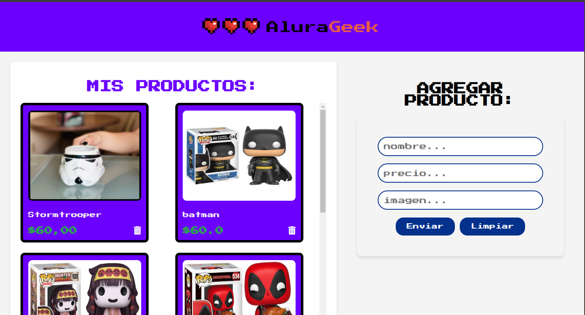
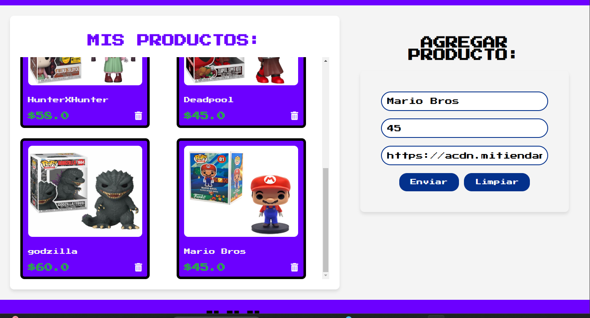
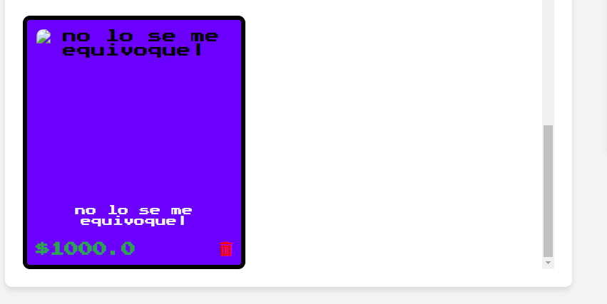
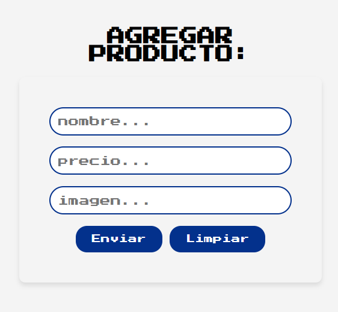
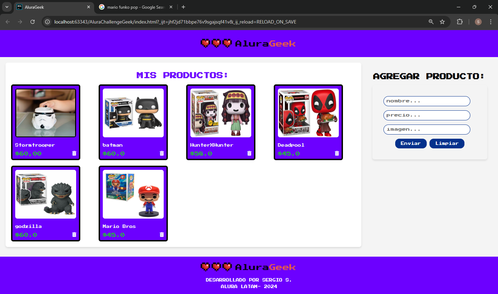

# AluraChallengeGeek
Hello 😁. This is my challenge of frontEnd to Alura Latam Oracle. Thanks for Watching,
# AluraGeek CRUD Project
<div style="background: #fff; display: flex; justify-content: center; align-items: center" >

</div>

Bienvenido al proyecto **AluraGeek**, una aplicación de CRUD (Crear, Leer, Actualizar, Eliminar) que permite gestionar productos. Utiliza un servidor JSON para almacenar los datos.

## 🚀 Funcionalidades

- **Crear productos**: Agregar nuevos productos con nombre, precio e imagen.
- **Leer productos**: Listar todos los productos disponibles.
- **Actualizar productos**: Modificar detalles de productos existentes.
- **Eliminar productos**: Borrar productos que ya no son necesarios.

## 📋 Requisitos

- Visual Studio Code o cualquier editor 

## 🛠️ Instalación

1. Clonar el repositorio:

    ```bash
    git clone https://github.com/Sarmientoserxh/AluraChallengeGeek.git
    ```

2. Navegar al directorio del proyecto:

    ```bash
    cd alura-geek
    ```

3. Instalar las dependencias:

    ```bash
    npm install
    ```

## 🚀 Ejecución

Para iniciar el servidor JSON y la aplicación:

1. Iniciar el servidor JSON:

    ```bash
    json-server --watch db.json --port 3001
    ```

2. Iniciar la aplicación:

 con live Server o algún plugin por defecto para ver el estado de tu pagina.

## 🔧 Uso

### Crear un Producto

- Llenar el formulario de producto con los detalles necesarios (nombre, precio, imagen).
- Hacer clic en **Enviar** para agregar el producto a la lista.

### Listar Productos

- Todos los productos se listan automáticamente al cargar la página.

### Eliminar un Producto

- Hacer clic en el icono de basura para eliminar un producto de la lista.

## 🖼️ Capturas de Pantalla
### panta inicial


### listar productos y agregar


### eliminar productos




### mis productos

## 📚 Documentación

- [API JSON Server](https://github.com/typicode/json-server)
- [Guía de Instalación de Node.js](https://nodejs.org/es/)

## 🛡️ Licencia

Este proyecto está licenciado bajo la Licencia MIT. Ver [LICENSE](LICENSE) para más detalles.

## 👨‍💻 Contribuyendo

Las contribuciones son bienvenidas. Por favor, haga un fork del repositorio y envíe un pull request.

## 📧 Contacto

- **Autor**: Tu Nombre
- **Email**: tu-email@example.com

---

¡Gracias por utilizar AluraGeek! reto hecho por Alura Latam Oracle.
